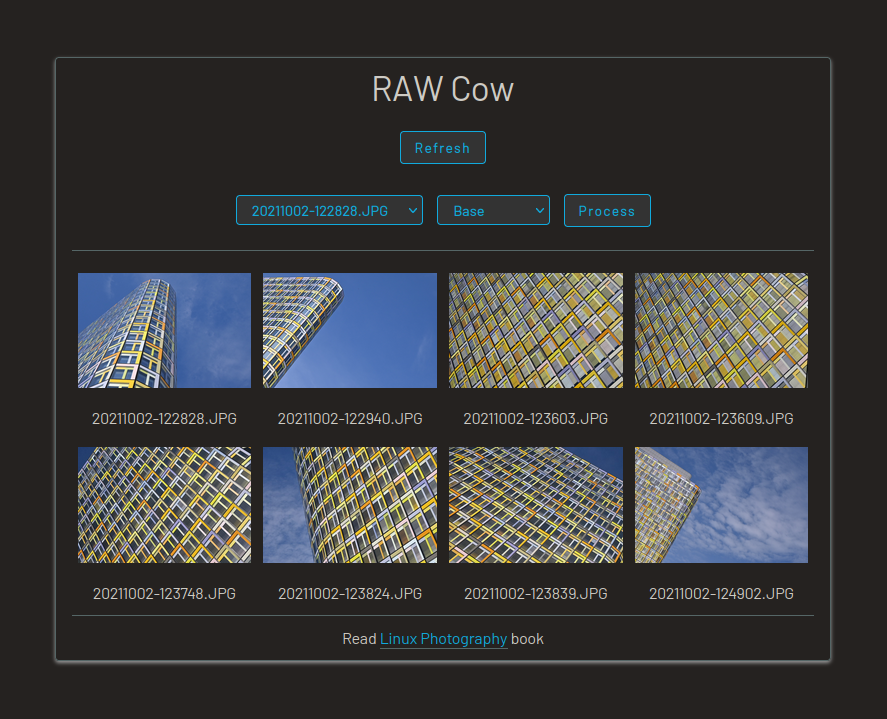

# RAW Cow

Simple PHP-based web application for instant RAW processing and publishing. RAW Cow can extract JPEG images embedded into RAW files or it can use [darktable](https://www.darktable.org/) to convert RAW files to JPEG. The application publishes the resulting JPEG files as a responsive gallery. RAW Cow also makes it possible to apply Hald CLUT presets to the JPEG files.

## Dependencies

- PHP
- ExifTool
- darktable (optional)
- Web server (Apache, Lighttpd, or similar)
- Git (optional)

## Installation and usage

1. Make sure that your local machine or remote web server has PHP and ExiTool installed.
2. Clone the project's repository using the `git clone https://github.com/dmpop/raw-cow.git` command. Alternatively, download the latest source code using the appropriate button on the project's page.
3. Open the _raw-cow/config.php_ file and change example values, if necessary.
4. Put RAW files into _raw-cow/RAW_ directory.
5. To run RAW Cow locally, switch in the terminal to the _raw-cow_ directory,  run the `php -S 127.0.0.1:8000` command, and point the browser to the _127.0.0.1:8000_ address.

## Run RAW Cow in a container

1. Install [Podman](https://podman.io) and [Buildah](https://buildah.io).
2. Create separate directories for RAW, JPEG, and Hald LUT files on the host machine.
3. Switch to the _raw-cow_ directory and build an image using the `./buildah.sh` command.
4. Run a container on port 8000: `podman run -d --rm -p 8000:8000 -v /path/to/RAW:/usr/src/raw-cow/RAW -v /path/to/JPG:/usr/src/raw-cow/JPG -v /path/to/LUT:/usr/src/raw-cow/LUT raw-cow` (replace _/path/to/RAW_ with the actual path to the directory for RAW files, _/path/to/JPG_ with the path to the an empty directory for the converted JPEG files, and _/path/to/LUT_ with the path to the a directory for storing Hald CLUT files).
5. Point the browser to _http://127.0.0.1:8000_ (replace _127.0.0.1_ with the actual IP address or domain name of the machine running the container).

The [Linux Photography](https://gumroad.com/l/linux-photography) book provides detailed information  on installing and using RAW Cow. Get your copy at [Google Play Store](https://play.google.com/store/books/details/Dmitri_Popov_Linux_Photography?id=cO70CwAAQBAJ) or [Gumroad](https://gumroad.com/l/linux-photography).

## Problems?

Please report bugs and issues in the [Issues](https://github.com/dmpop/raw-cow/issues) section.

## Contribute

If you've found a bug or have a suggestion for improvement, open an issue in the [Issues](https://github.com/dmpop/raw-cow/issues) section.

To add a new feature or fix issues yourself, follow the following steps.

1. Fork the project's repository.
2. Create a feature branch using the `git checkout -b new-feature` command.
3. Add your new feature or fix bugs and run the `git commit -am 'Add a new feature'` command to commit changes.
4. Push changes using the `git push origin new-feature` command.
5. Submit a pull request.

## Author

[Dmitri Popov](https://www.tokyoma.de/)

# License

The [GNU General Public License version 3](http://www.gnu.org/licenses/gpl-3.0.en.html)
